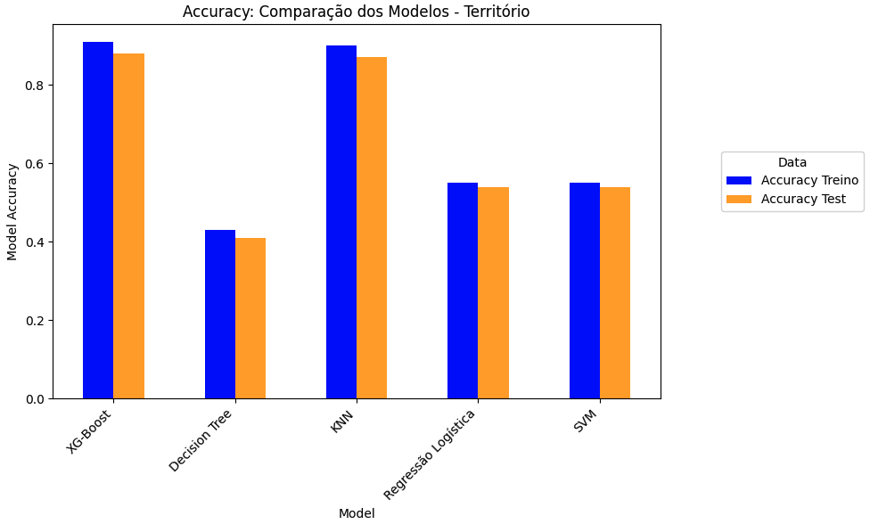

# ProjetoFinalCollege
Este projeto, realizado no âmbito da Unidade Curricular Projeto Final Aplicado em Ciência de Dados, pretende, através da metodologia CRISP-DM, explorar a utilização de técnicas de machine learning que auxiliem a caracterização de registros que compõem o balanço estatístico dos Fundos de Investimento.
A metodologia CRISP-DM é composta por diversas fases, nomeadamente, a Compreensão do Problema (Business Understanding), a Compreensão dos Dados (Data Understanding), Preparação dos Dados (Data Preparation), Modelagem (Modeling), Interpretação dos Resultados (Evaluation) e, por fim, Implementação (Deployment). 


### Compreensão do Problema
O objetivo deste projeto é desenvolver um mecanismo de machine learning para aprimorar o processo estatístico, nomeadamente na categorização de movimentos de fundos de investimento. Esta categorização é atualmente realizada manualmente, podendo originar classificações imprecisas. Desta forma, o objetivo principal é reduzir a incidência de classificações incorretas, utilizando as descrições de instrumentos de investimentos para derivar o setor financeiro e o território da instituição que realiza o movimento, que tem a sua representação no ficheiro nas variáveis "SetorInstitucionalCon" e "TerritorioCon". Como consequência é eliminado o tempo consumido pelo processo manual. Ao implementar este sistema de machine learning, esperamos não apenas aumentar a precisão das classificações, mas também agilizar o fluxo de trabalho, libertando recursos humanos para tarefas mais estratégicas e analíticas.

###  Limpeza dos Dados
A limpeza e o processamento de texto são etapas cruciais na preparação de dados para tarefas de processamento de linguagem natural (Natural Language Processing, NPL). Estas etapas removem ruídos e inconsistências de texto, e como referido, transformam o texto num formato adequado para análise e modelação. <br>

Nesta etapa foi utilizada a função ‘simple_preprocess’, função desenvolvida pela Google. Com esta função os processamentos realizados são:
Remoção de pontuação: Pontuação como vírgulas, pontos e exclamações são removidas do texto.
Conversão para minúsculas: Todo o texto é convertido para minúsculas para padronizar a formatação.
Remoção de espaços em branco extra: Espaços em branco extra são removidos para melhorar a legibilidade do texto.
Remoção de stopwords: Palavras comuns e sem significado, como "a", "o", "que", são removidas para reduzir a dimensionalidade do texto. <br>

Podemos verificar o seguinte exemplo de um descritivo antes e depois de aplicar a função: 
‘BST Futuros 2.90%’ → [bst, futuros]

#### Word2Vec Modelo para Processar Descritivo 
O Word2Vec é um algoritmo de machine learning que representa palavras como vetores numéricos, ou seja, cada palavra é mapeada numa sequência de números, onde são capturadas as suas características semânticas e relações com outras palavras. Estes vetores podem ser chamados de “Embeddings”. <br>
O algoritmo é treinado num grande campo de texto, analisando como são utilizadas as palavras em diferentes contextos. Normalmente existem duas arquiteturas principais, contudo só referimos a utilizada no desenvolvimento do projeto que é a Continuous Bag-of-Words(CBOW).<br>

O CBOW prediz uma palavra central (target) com base nas palavras de contexto que a rodeiam numa janela de contexto. No nosso caso, aplicamos esta técnica para processar a variável "DescricaoInstrumento", transformando cada descrição em uma sequência de palavras (tokens) que são convertidas em vetores numéricos. Para o treino do modelo foram realizados 3 passos:
- Criação de um one-hot-encoding para cada palavra;
- Definição do tamanho na nossa window size;
- Ter uma única hidden layer (embeddings finais) e um único output layer.

De uma maneira resumida, no contexto do nosso problema, o CBOW foi utilizado para transformar as descrições dos instrumentos financeiros em vetores de embeddings. Estes embeddings foram então usados como features no treino dos modelos de machine learning, permitindo assim captar a semântica das descrições dos instrumentos e melhorar a precisão das previsões do setor institucional (“SetorInstitucionalCon”) e do território da contraparte (“TerritorioCon”). Os benefícios da utilização do CBOW no nosso problema foram:
Representação Eficiente de Palavras: Os vetores numéricos são mais compactos e mais fáceis de processar do que as representações tradicionais de sacos de palavras (bag-of-words);
Captura de Relações Semânticas: Os embeddings capturam a similaridade semântica entre palavras, permitindo que o modelo aprenda relações complexas de significado nas descrições dos instrumentos.
Melhoria da Precisão dos Modelos: Com a transformação das descrições em vetores de alta qualidade, os modelos de machine learning conseguiram fazer previsões mais precisas sobre as variáveis-alvo.

## Treino dos Modelos
Foram desenvolvidos dois modelos de machine learning distintos: um para prever o setor da contraparte e outro para prever o território da contraparte. A decisão de utilizar dois modelos separados para prever o setor e o território da contraparte mostrou vantagens significativas. <br>

Para realizar as previsões, foram utilizados diversos modelos de machine learning, dos quais destacamos o K-Nearest Neighbors (KNN), Decision Tree, Regressão Logística, Support Vector Machine (SVM) e XGBoost.

### Performance dos Modelos


Para avaliar a performance dos modelos de forma justa e garantir que generalizam bem com novos dados, o dataset foi dividido em conjuntos de treino e teste, utilizando uma divisão de 80-20, onde 80% dos dados foram utilizados para treinar os modelos e 20% foram reservados para teste. O XGBoost foi o modelo que obteve os melhores resultados nas métricas calculadas de precisão(accuracy), sensibilidade(recall) e precisão(precision), desta maneira, foi escolhido como a melhor opção para o desenvolvimento do nosso projeto. Podem ser consultados abaixo gráficos explicativos que mostram as diversas performances de cada um dos modelos acima mencionados.  <br>


 o XGBoost é baseado em árvores de decisão e utiliza boosting para melhorar a performance preditiva. É conhecido pela eficiência, flexibilidade e alto desempenho nas competições de machine learning. O XGBoost cria uma sequência de árvores de decisão, onde cada árvore tenta corrigir os erros das anteriores, utilizando uma combinação de técnicas de regularização para evitar o overfitting, tornando o modelo robusto e eficiente. 


## Construção do Dashboard


Criamos um dashboard pra analisar e treinar. 
Começamos por apresentar uma página principal, que seria a cara do projeto. Aqui havia a possibilidade de fazer uma previsão única, inserindo um descritivo manualmente ou selecionando um dos exemplos rápidos incorporados, e também proceder ao Upload de um ficheiro (excel ou csv) com estrutura semelhante ao dataset original, para que a ferramenta aplicasse o modelo nas várias linhas adicionando as devidas previsões a esse mesmo ficheiro. Após isto, o download do novo ficheiro atualizado era disponibilizado. Ainda assim, após algumas discussões e reuniões fomos desafiados a tornar o nosso dashboard mais completo, e optamos por incluir duas novas páginas: Análises e Training.
<br><br>
Neste timing foram também treinados novos modelos de diferentes naturezas, que foram posteriormente incluídos no dashboard para que o utilizador pudesse escolher aquele que mais se enquadraria. A página Análises começa por mostrar gráficos de comparação das métricas dos vários modelos disponíveis, para auxiliar na escolha do modelo ideal. Existem os gráficos precision, accuracy e recall. Para além disto, foram incluídas as análises aos tokens que tinham sido previamente desenvolvidas, a análise de tokens por setor e território. Para o território, foi incorporado o mesmo mapa interativo que permite analisar o tema de uma forma mais intuitiva, obtendo os tokens mais frequentes ao selecionar um país. Já para o setor o procedimento é semelhante à exceção do mapa, que é trocado por uma tabela na qual podemos selecionar o setor pretendido e esta mostrará os tokens mais frequentes para o mesmo.
<br><br>
Por fim, o maior desafio no desenvolvimento do dashboard foi a página Training. O nome é indicativo, uma vez que nesta aba podemos treinar novamente o modelo já existente. Existem dois métodos: Adicionar um caso único ou Upload de um ficheiro. O primeiro recorre ao preenchimento de um formulário com as features que estão normalmente associadas a cada transação. Após o preenchimento do formulário, essa informação resulta numa nova linha que é adicionada ao dataset de treino e o processo de treino ocorre de forma igual ao que havia sido feito. Tanto o dataset de treino como o modelo anterior são armazenados localmente para assegurar que um erro não resulte numa perda maior. Para o upload de um ficheiro, o processo é igual. O sistema recebe um ficheiro e verifica se neste constam as colunas que são necessárias para prosseguir. Após a devida verificação, as linhas do ficheiro são adicionadas ao dataset de treino e o processo repete-se. Após o treino de novos modelos, as métricas que surgem na página de análises são também atualizadas.


# Como correr o código
1. Instale todas as dependencias para o projeto: 
```
pip install -r requirements.txt
```
ps: Certifique que está no diretório certo. A versão do python utilizada foi Python 3.10.9

2. Adicione os dados necessários
- Para treinar o modelo coloque dentro do folder **projetofinal/data_train** adicione os dados que utilizará para treinar o modelo
- Adicione o ficheiro para qual quer fazer as precisões dento de **projetofinal/data_missing**
- Também adicione um data set para avaliar o modelo
ps: Para fazer a precisão é necessário correr treino pelo menos uma vez para ter o modelo primeiro

3. Corra o comando no seu terminal para treinar
```python
python -m projetofinal train --data_path "data_path"
```
ps: 
- Só é preciso correr uma vez, porém se tiver mais dados e quiser atualizar o modelo, correr de novo para treinar novamente com mais dados
- Mude o data_path para onde os dados estão no seu computador

4.  Faça a previsão usando o comando abaixo
```python
python -m projetofinal train --order "pred" --format "csv"  --data_path "data_path" --model_name "name_of_model"
```
ps: indique o formato que o ficheiro dos dados está [csv, xlsx]

5. Para saber a performance do seu modelo compre
```python
python -m projetofinal train --order "eval" --data_path "data_path" --model_path 'model_path'  --format "csv" --model_name "name_of_model" 
```

6. Para correr o dashboard no seu terminal no root directory corra o seguinte comando
```python
streamlit run dashboard.py    
```

- Mude o data_path para onde os dados estão no seu computador
- Mude o fomato para o formato do seu  ficheiro .csv ou .xlsx